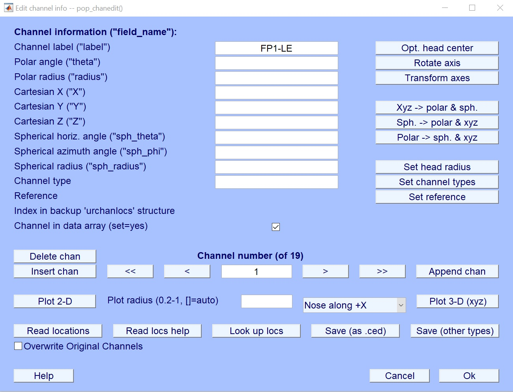
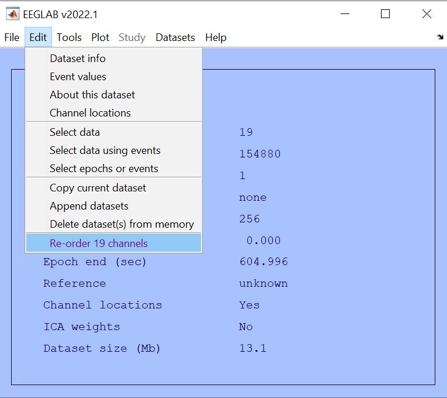
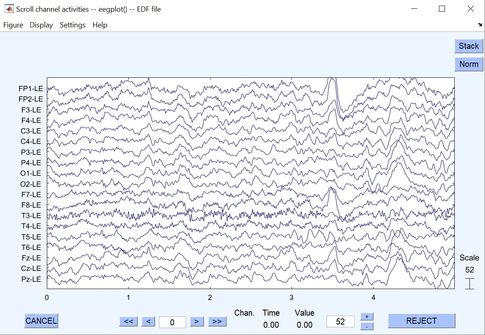
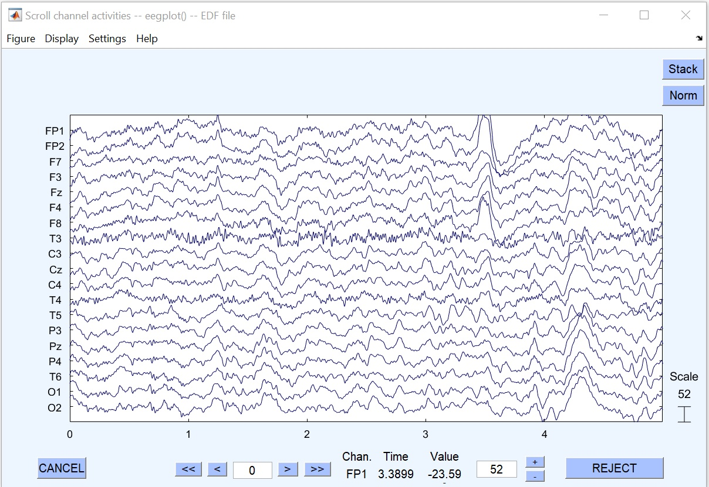

# reorder19channels
This EEGLAB plugin assumes there are 19 channels in your data whose labels ending with '-LE' i.e. 'Fp1-LE', 'Fp2-LE', etc.. Typically, when you save 19-channel data using [NeuroGuide](https://appliedneuroscience.com/neuroguide/), the saved data look like this. You can confirm it from 'Edit' -> 'Channel locations' and it should look as follows. 

Once you confirm it, you run this plugin. No GUI will be launched. Just press the button and it's done.

Below I show before-after comparison.

Before

After

01/12/2024 Makoto Miyakoshi.
